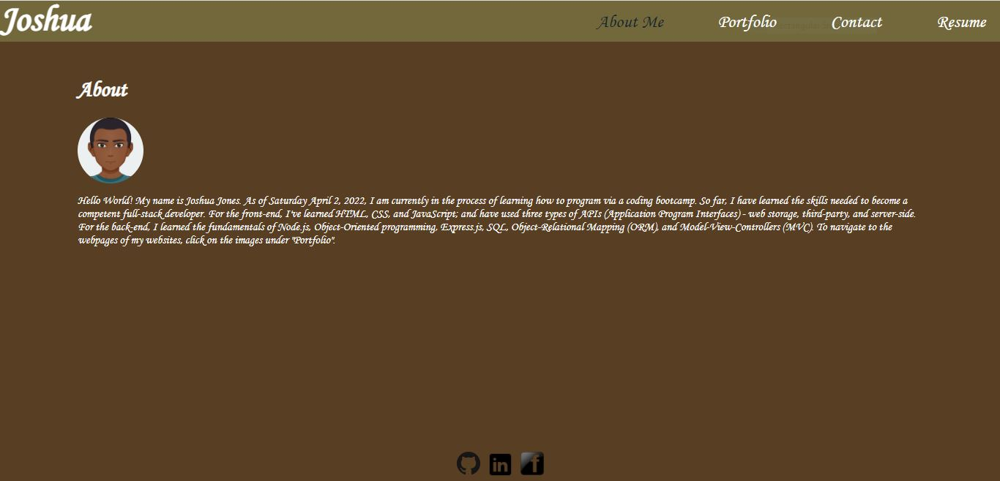

# Programming Portfolio

## Purpose 
This site showcases six of my projects, including my first portfolio. However, unlike the first portfolio, which is built with HTML and CSS, this one is built with react. The site is only a single-page. The site can dynamically render four sections on said page, as indicated by the navigation menu. On the resume page, my proficiencies are showcased and a link is provided as to allow the download of my resume. On each project on the portfolio section, there will be a link on the upper-left corner and a GitHub on the upper-right corner. The former is a link to the application; the latter, the corresponding repository.    

## Built With
    * React

## Screenshot

## Packages Required
    * npx create-react-app photo-port
    * npm install -D gh-pages
    * npm run deploy

## Website Link
<!-- place here -->

## Contribution
CoderJ01 